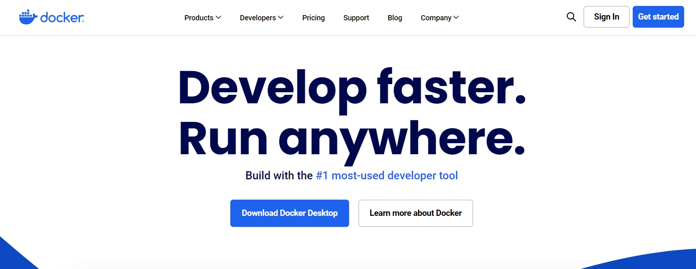
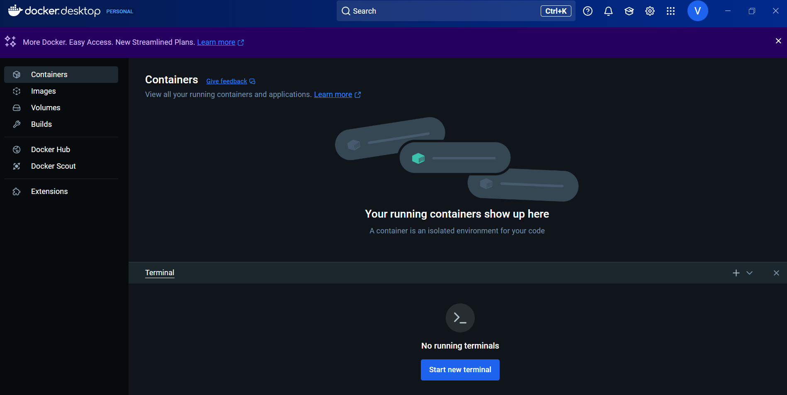

# HOW TO INSTALL ALMALINUX 9 USING DOCKER (Windows)
Author: Apolloni Vittorio.\
Last Updated: march, 4, 2025.
__________________________________________________________________

In your life, it might happen that you choose to follow a course on scientific computing, and the first task will be to write a Markdown on how to install AlmaLinux 9 using Docker. Don't worry, follow these instructions and you'll be set up in no time. For those of you who are completelly new to these arguments i also leave a link for a Markdouwn guide on GitHub -> [link](https://docs.github.com/en/get-started/writing-on-github/getting-started-with-writing-and-formatting-on-github/basic-writing-and-formatting-syntax) 

## Introduction
Before continuing with the steps to complete the task, let's understand what Docker is.
Docker is a popular open-source software that uses operating-system-level virtualization to run applications in isolated environments called containers. Docker containers are an extension of OS containers. Docker supports both Linux and Windows containers. It is possible to use Docker with Linux containers on Windows and MacOS systems thanks to virtualization techniques (information taken from [wikipedia](https://it.wikipedia.org/wiki/Docker)).\
As we will see We will use Docker to install Almalinux 9 on Windows. 


### 1) Install Windows  Subsystem for Linux (WSL)
1. Open your terminal;
2. Run the command:
```
wsl --install
```
3. Make sure to use version 2:
```
wsl --set-default-version 2
```


### 2) Install Docker
The first step is to download Docker from their official site, you  can find it [here](https://www.docker.com/).

Move over the "Download Docker Desktop" button and choose the Windows option. The Download should start automatically. At the end of the download run the downloaded file and wait for the installation.\
>[!warning]
>Be aware to check the "Use the WSL 2 based engine" option.

At the end of the Installation it will ask you to restart  Windows. 
The program will now ask you to create an account (or you can use the GitHub account that you should have from the beginning of this course) and then you're ready to go.

For learning about Docker: basic concepts, how to set up the environment, running containers and more, consider checking this [site](https://docs.docker.com/get-started/). 

### 3) Run a Container with Almalinux 9
1. Open Docker Desktop;
2. From the docker terminal pull the Almalinux 9 image:
```
docker pull almalinux:9
```

3. In the terminal insert:
```
docker run -it -name [the name of your container] almalinux:9 bash
```
4. On Docker you should now see the created container;
5. Type `exit` to exit from the container;

You have now completed the first Task. 


